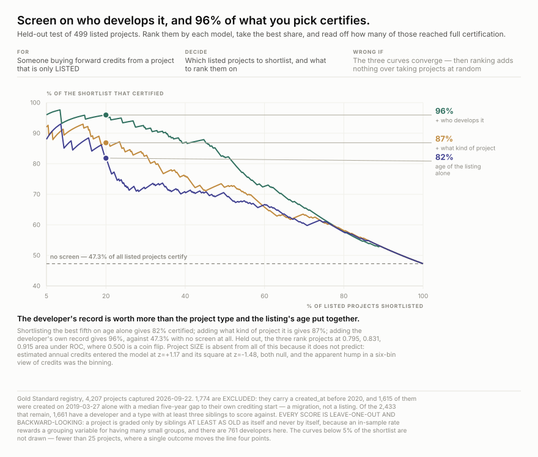
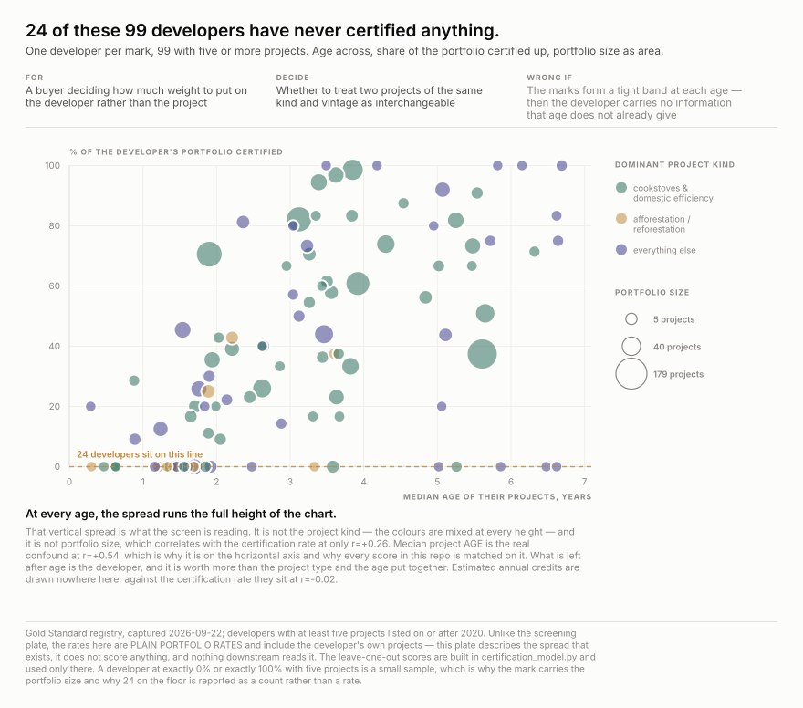
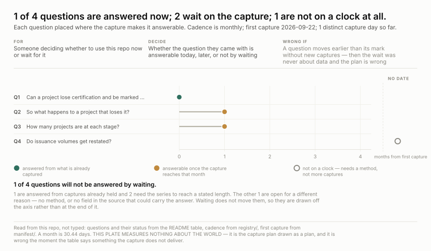

# wss-carbon-registry — the Gold Standard carbon project register

Every project in the Gold Standard registry: name, status, methodology, type,
size, estimated annual credits, crediting period, SustainCert id.
**4,207 projects captured on 2026-09-22.**

**Status: paused, with one full baseline capture.** Read
[registry/goldstandard.registry.projects.yml](registry/goldstandard.registry.projects.yml) first.

**One capture already answers the buyer's question.** Ranking listed projects on the developer's record puts **96%** of the best fifth into full certification, against a **47.3%** base rate — held out, and with project size contributing nothing.

## Why this exists

The status vocabulary across all 4,207 projects is **exactly three values, and
every one is a step forward**:

| status | projects |
| --- | ---: |
| `GOLD_STANDARD_CERTIFIED_PROJECT` | 2,279 |
| `LISTED` | 1,061 |
| `GOLD_STANDARD_CERTIFIED_DESIGN` | 867 |

There is no withdrawn, cancelled, expired or suspended. **A project that loses
certification has nowhere in this schema to be marked as having lost it** — so it
either freezes at its last step or leaves the register. Which one happens needs a
second capture, and the baseline for that now exists.

## Nobody else holds this

Measured, not assumed, on 2026-09-22:

- `public-api.goldstandard.org/projects` — **zero** Internet Archive mementos.
- `registry.goldstandard.org/projects` — 68 mementos, 2021 to 2026. Four sampled
  captures are **~2 KB client-rendered shells**, 59 characters of visible text,
  **not one project id between them**. The UI is a JavaScript application and the
  Archive photographed an empty frame 68 times.

So the register as it stood on any past date is not recoverable from anywhere.

## Why it is paused

The API is a bare JSON array, 25 per page, with no total in the response. The
capture is *page until an empty array* — 169 pages today, a different number next
month. `Endpoint` carries a fixed `url`, so expressing this needs either 169
hand-listed endpoints that go stale or a paging primitive the engine does not
have. Same class of limitation as `eudragmdp.gmp.noncompliance`'s session handshake.
The baseline in `raw/` was taken by script.

## One trap, already paid for

`created_at` puts **1,774 of 4,207 projects in 2019** — 42% in a single year,
against 321 the next. That is a platform migration timestamp, not a founding date.
Anything keyed on `created_at` will read a migration as a boom.

## What one capture already answers

The registry publishes no status history and no terminal state, so the obvious
move is to wait for a second capture. But `created_at` and the three progression
statuses are already in every record, which means a project's outcome can be read
against projects of **matched age** without waiting for anything.

**A buyer looking at a LISTED project wants to know whether it will certify.**

Held out on 499 projects, ranking the best fifth gives **82%** certified
on the listing's age alone, **87%** once you add what kind of project
it is, and **96%** once you add the developer's own record —
against **47.3%** with no screen at all. Area under ROC goes
0.795 → 0.831 → 0.915.

**Project size predicts nothing.** Estimated annual credits span seven orders of
magnitude here and enter the model at z=+1.17, its square at z=-1.48. Both null. A
six-bin view of credits showed a tidy hump peaking in the middle; the continuous
fit says the hump was the binning.

At every project age the certification rate runs the full height of the chart, and
the colours — what kind of project each developer mostly builds — are mixed at
every height. **24 of the 99 developers with five or more projects have never
certified a single one.** That vertical spread is what the screen is reading.

**Two traps were paid for getting here, and both are in the plate footnotes.**
`created_at` is not a listing date for 42% of the registry — 1,615 of 4,207
records were created on **2019-03-27 alone**, with a median five-year gap to their
own crediting-period start. That is a migration, and everything above is
restricted to `created_at >= 2020`. And every score is **leave-one-out and
backward-looking**: a project is graded only by siblings at least as old as
itself, never by itself, because an in-sample rate rewards a grouping variable for
having many small groups and there are 761 developers in 2,433 projects.

Rebuild with [`examples/certification_model.py`](examples/certification_model.py),
then the two chart scripts.

## Questions this exists to answer

Five are answered from the one capture already held. Two need a second capture and the plate says when. The last is not on a clock — it needs a different endpoint, and waiting will not produce it.

| # | question | status |
| --- | --- | --- |
| Q1 | Which listed projects actually reach full certification? | **answered** — held out, ranking on the developer's record puts 96% of the best fifth into certification against a 47.3% base rate → [screening](examples/charts/screening.svg) |
| Q2 | Does the size of a project predict whether it certifies? | **answered — no.** Estimated annual credits entered the model at z=+1.17 and its square at z=-1.48, both null. A six-bin view showed a hump; the continuous fit says it was the binning. *No figure: a null drawn as a scatter of 2,274 flat points is the axis, not a finding — the screening plate states it instead* |
| Q3 | Does who develops it matter more than what kind of project it is? | **answered — yes**, by roughly triple. Developer record +1.797 against project type +0.507 in the same model, and 24 of 99 developers with five or more projects have never certified anything → [developers](examples/charts/developers.svg) |
| Q4 | Is `created_at` a listing date? | **answered — not for 42% of the registry.** 1,615 of 4,207 records were created on 2019-03-27 alone, with a median five-year gap to their own crediting-period start. That is a migration. Everything here is restricted to `created_at >= 2020`. *No figure: this is a single-day spike in one field, and the footnote on both plates carries it* |
| Q5 | Can a project lose certification and be marked as having lost it? | **answered — no.** The status vocabulary is three values and all three are progression steps: LISTED, GOLD_STANDARD_CERTIFIED_DESIGN, GOLD_STANDARD_CERTIFIED_PROJECT. There is no withdrawn, cancelled, expired or suspended. *No figure: this is an absent vocabulary, not a distribution* |
| Q6 | So what happens to a project that loses it? | needs 2+ captures. **The reason for capturing, and deliberately flagged UNPROVEN** — with no terminal state it must either freeze at its last progression or disappear, and only a second capture separates those |
| Q7 | Do the projects that never certify stall, or leave? | needs 2+ captures — the screening plate shows 53% of listed projects have not certified, and one capture cannot say which of those are still trying |
| Q8 | Do issuance volumes get restated after certification? | open — needs the issuance endpoint, not more captures of the project list |

## Licence

Code: MIT ([LICENSE](LICENSE)). **The data carries no onward licence from this
repository** — see [LICENSE-DATA](LICENSE-DATA). Gold Standard's terms address
trademarks and event media and say nothing about the registry or its API, so what
they permit is unknown and is recorded as unknown. Attribute the Gold Standard
Foundation, not this repo.
